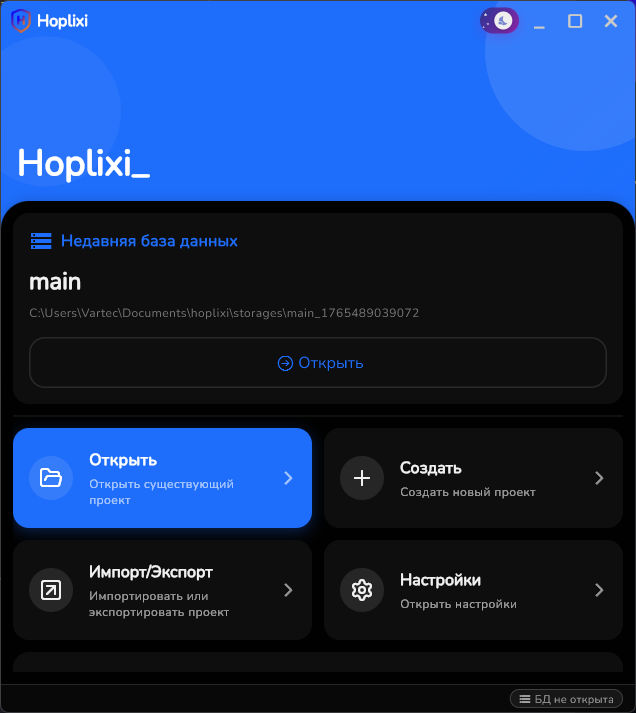

# Hoplixi - Менеджер Паролей 🔐

[](https://flutter.dev/)
[](https://dart.dev/)
[](LICENSE)

> **Hoplixi** - это современный, безопасный и удобный менеджер паролей для хранения, генерации и управления вашими учетными данными. Защитите свои онлайн-аккаунты с помощью мощного шифрования и интуитивного интерфейса.


## ✨ Особенности

### 🔒 Безопасность
- **Военное шифрование**: AES-256 и SQLCipher для защиты данных
- **Биометрическая аутентификация**: Поддержка Touch ID / Face ID / Windows Hello
- **Локальное хранение**: Все данные хранятся локально на устройстве
- **Мастер-пароль**: Дополнительный уровень защиты

### 🚀 Функциональность
- **Генерация паролей**: Создание сильных, уникальных паролей
- **Автозаполнение**: Быстрое заполнение форм в браузерах и приложениях
- **Категоризация**: Организация паролей по категориям и тегам
- **Поиск**: Мгновенный поиск по всем сохраненным данным
- **Импорт/Экспорт**: Поддержка различных форматов обмена данными

### 📱 Кроссплатформенность
- **Android** и **iOS**: Нативные мобильные приложения
- **Windows**, **Linux** и **macOS**: Десктопные версии


### 🔧 Дополнительные возможности
- **OTP Генератор**: Встроенный генератор одноразовых паролей (2FA)
- **QR-сканер**: Сканирование QR-кодов для быстрого добавления аккаунтов
- **Облачное синхронизирование**: Синхронизация между устройствами
- **Виджеты**: Быстрый доступ к паролям с главного экрана
- **Темная тема**: Поддержка светлой и темной темы оформления

## 📸 Скриншоты

- Главный экран приложения


## 🛠 Установка и запуск

### Предварительные требования
- [Flutter](https://flutter.dev/docs/get-started/install) (версия 3.10.3 или выше)
- [Dart](https://dart.dev/get-dart) SDK
- Для мобильной разработки: Android Studio / Xcode

### Клонирование репозитория
```bash
git clone https://github.com/vartec-chs/Hoplixi
cd Hoplixi
```

### Установка зависимостей
```bash
flutter pub get
```

### Генерация кода
```bash
flutter pub run build_runner build --delete-conflicting-outputs
```
`or is on Windows`
```bash
build_runner.bat
```

### Запуск приложения (dev mode)

#### Android
```bash
flutter run -d android
```

#### iOS
```bash
flutter run -d ios
```

#### Windows
```bash
flutter run -d windows
```

#### Linux
```bash
flutter run -d linux
```

#### macOS
```bash
flutter run -d macos
```

## 📖 Использование

### Первый запуск
1. Установите мастер-пароль при первом запуске
2. Настройте биометрическую аутентификацию (рекомендуется)
3. Добавьте свои первые учетные данные

### Добавление нового пароля
1. Нажмите кнопку "Создать" на главном экране
2. Выберите категорию или создайте новую
3. Введите данные аккаунта
4. Используйте генератор паролей для создания сильного пароля
5. Сохраните изменения

### Генерация OTP
1. Перейдите в раздел "OTP Генератор"
2. Отсканируйте QR-код или введите секретный ключ вручную
3. Используйте сгенерированные коды для двухфакторной аутентификации

## 🏗 Архитектура

Hoplixi построен с использованием современных технологий:

- **Flutter**: Кроссплатформенный UI фреймворк
- **Riverpod**: Управление состоянием
- **Drift**: ORM для работы с базой данных
- **SQLCipher**: Шифрование базы данных
- **Freezed**: Генерация иммутабельных моделей
- **Go Router**: Навигация между экранами

### Структура проекта
```
lib/
├── app.dart                 # Главный виджет приложения
├── main.dart               # Точка входа
├── core/                   # Базовые сервисы и утилиты
│   ├── logger/            # Логирование
│   ├── services/          # Бизнес-логика
│   ├── theme/             # Темизация
│   └── utils/             # Утилиты
├── features/              # Функциональные модули
│   ├── home/              # Главный экран
│   ├── password_manager/  # Управление паролями
│   ├── settings/          # Настройки
│   └── ...
├── main_store/            # База данных и модели
├── routing/               # Навигация
└── shared/                # Общие компоненты
```

## 🔧 Разработка

### Сборка для релиза

#### Android APK
```bash
flutter build apk --release
```

#### iOS
```bash
flutter build ios --release
```

#### Windows
```bash
flutter build windows --release
```

### Тестирование
```bash
flutter test
```

### Анализ кода
```bash
flutter analyze
```

### Форматирование
```bash
dart format .
```

## 🤝 Вклад в проект

Мы приветствуем вклад в развитие Hoplixi! Вот как вы можете помочь:

1. **Fork** репозиторий
2. Создайте **feature branch** (`git checkout -b feature/AmazingFeature`)
3. **Commit** изменения (`git commit -m 'Add some AmazingFeature'`)
4. **Push** в ветку (`git push origin feature/AmazingFeature`)
5. Откройте **Pull Request**

### Руководство по контрибьютингу
- Следуйте [Effective Dart](https://dart.dev/effective-dart) гайдлайнам
- Используйте [Flutter lints](https://pub.dev/packages/flutter_lints)
- Пишите тесты для нового функционала
- Обновляйте документацию при внесении изменений

## 💭 Планы после релиза

В планах на будущее:

- **Переписывание на Rust**: Переписать основную логику приложения на Rust для повышения производительности, безопасности и эффективности работы с памятью
- **Новые функции**: Auto-Type, Cloud Sync, Расширения для браузеров, LocalSend и многое другое
- **Улучшение UX**: Оптимизация интерфейса и добавление новых тем оформления и возможностей кастомизации

## 📄 Лицензия

Этот проект распространяется под лицензией MIT. Подробности в файле [LICENSE](LICENSE).

## 🙏 Благодарности

- [Flutter](https://flutter.dev/) - за отличный фреймворк
- [Lucide Icons](https://lucide.dev/) - за красивые иконки
- [Riverpod](https://riverpod.dev/) - за управление состоянием
- Сообществу Flutter за поддержку и вдохновение

## 📞 Контакты

- **Автор**: [Кирилл](https://github.com/vartec-chs)
- **Email**: misticmvm@gmail.com
- **Telegram**: [@VartecCHS](https://t.me/VartecCHS)
- **Issues**: [GitHub Issues](https://github.com/vartec-chs/hoplixi/issues)

---

<p align="center">
  <b>Hoplixi</b> - Ваш надежный страж цифровой безопасности! 🛡️
</p>

<p align="center">
  
  
  
</p>
